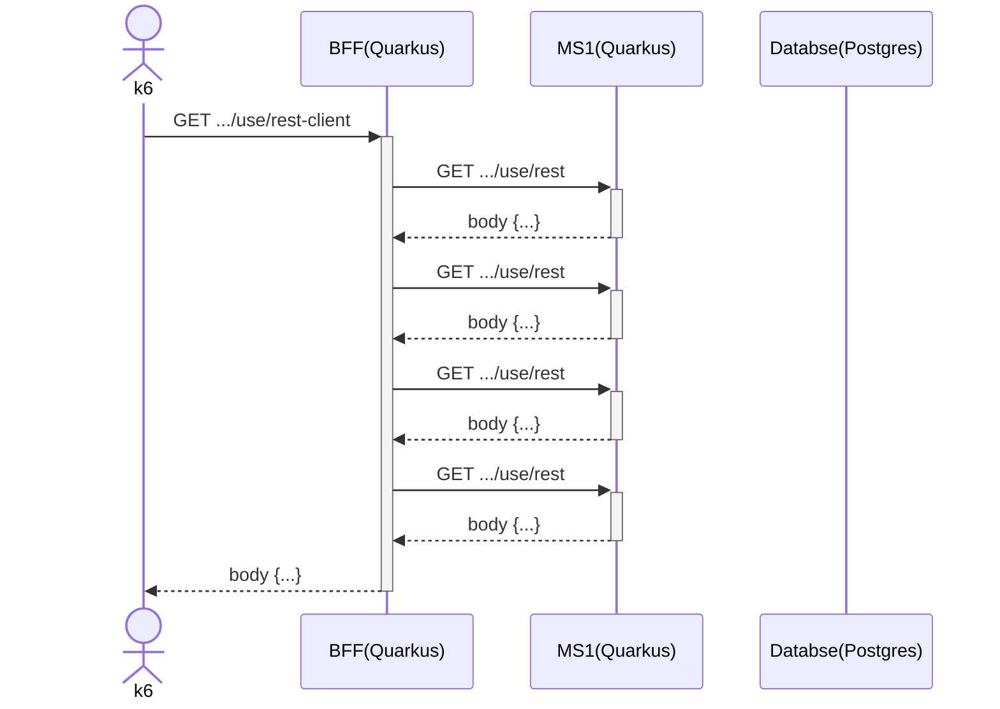

Endpoint que faz 4 chamadas rest ao ms1

```mermaid
sequenceDiagram
  actor k6
  participant bff as BFF(Quarkus)
  participant ms1 as MS1(Quarkus)
  participant db as Databse(Postgres)
  k6->>+bff: GET .../use/rest-client
    bff->>+ms1: GET .../use/rest
    ms1-->>-bff: body {...}
    bff->>+ms1: GET .../use/rest
    ms1-->>-bff: body {...}
    bff->>+ms1: GET .../use/rest
    ms1-->>-bff: body {...}
    bff->>+ms1: GET .../use/rest
    ms1-->>-bff: body {...}
  bff-->>-k6: body {...}
```
