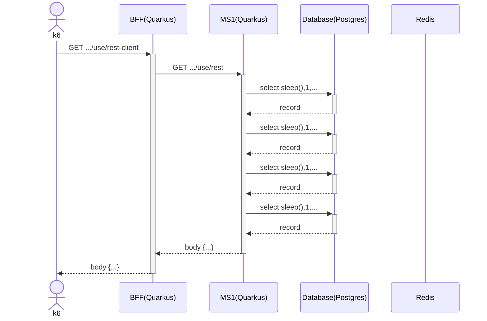

```mermaid
sequenceDiagram
    actor k6
    participant bff as BFF(Quarkus)
    participant ms1 as MS1(Quarkus)
    participant db as Database(Postgres)
    participant redis as Redis
    k6 ->>+ bff: GET .../use/rest-client
    bff ->>+ ms1: GET .../use/rest
    ms1 ->>+ db: select sleep(),1,...
    db -->>- ms1: record
    ms1 ->>+ db: select sleep(),1,...
    db -->>- ms1: record
    ms1 ->>+ db: select sleep(),1,...
    db -->>- ms1: record
    ms1 ->>+ db: select sleep(),1,...
    db -->>- ms1: record
    ms1 -->>- bff: body {...}
    bff -->>- k6: body {...}
```
