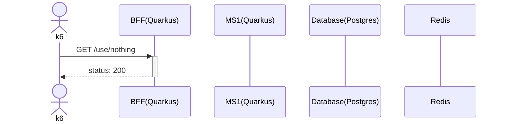

Endpoint que apenas responde 200 `Response.on().build()`

```mermaid
sequenceDiagram
    actor k6
    participant bff as BFF(Quarkus)
    participant ms1 as MS1(Quarkus)
    participant db as Database(Postgres)
    participant redis as Redis
    k6 ->>+ bff: GET /use/nothing
    bff -->>- k6: status: 200
```
