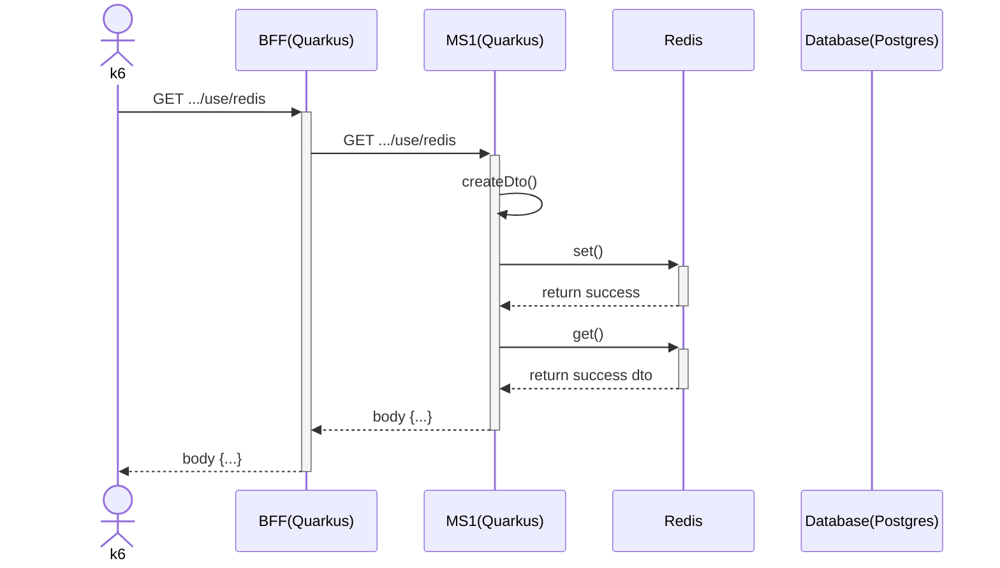

```mermaid
sequenceDiagram
    actor k6
    participant bff as BFF(Quarkus)
    participant ms1 as MS1(Quarkus)
    participant redis as Redis
    participant db as Database(Postgres)
    k6 ->>+ bff: GET .../use/redis
    bff ->>+ ms1: GET .../use/redis
    
    ms1 ->> ms1: createDto()
    
    ms1 ->>+ redis: set()
    redis -->>-ms1: return success
    
    ms1 ->>+ redis: get()
    redis -->>- ms1: return success dto
    
    ms1 -->>- bff: body {...}
    bff -->>- k6: body {...}
```
